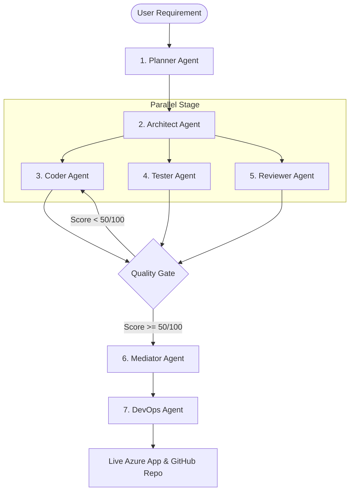

# Swarm Factory 🤖🏭

> Type a requirement. Get a working codebase. Deployed and tested in minutes.

Built for the **Microsoft Build AI Hackathon 2026 — Theme 05: Agent Swarms**.

---

## 📖 Overview

Swarm Factory is an autonomous multi-agent platform that translates plain-English requirements into fully deployed, production-ready codebases. By leveraging a coordinated swarm of **7 specialized AI agents**, it handles planning, design, coding, testing, review, and DevOps pipeline setup completely autonomously.



### The 7-Agent Pipeline

| Agent | Role | Focus | Model Configuration |
|---|---|---|---|
| **Planner** | Task Decomposer | Breaks requirements into an ordered task graph (DAG). | GPT-4o (`temp=0.2`) |
| **Architect** | Stack Designer | Designs tech stack, directory structure, and API contracts. | GPT-4o (`temp=0.2`) |
| **Coder** | Software Engineer | Writes all application and source code. | GPT-4o (`temp=0.2`) |
| **Tester** | QA Engineer | Writes unit & integration test suites. | GPT-4o (`temp=0.2`) |
| **Reviewer** | Security Auditor | Reviews code for security (OWASP Top 10), lint, and best practices. | GPT-4o (`temp=0.2`) |
| **Mediator** | Conflict Resolver | Resolves code merge conflicts and enforces the Quality Gate. | GPT-4o (`temp=0.2`) |
| **DevOps** | System Deployer | Sets up Docker, GitHub actions CI/CD, and deploys to Azure. | GPT-4o (`temp=0.2`) |

---

## 🛠️ Microsoft Stack & Technologies

*   **Azure OpenAI**: Powering the multi-agent orchestration (utilizing `gpt-4o` as primary, `phi-4` as secondary fallback, and `gpt-4o-mini` as tertiary fallback).
*   **AutoGen**: Orchestrates multi-agent group conversations.
*   **Semantic Kernel**: Implements the memory layer and handles embeddings.
*   **Azure AI Search**: Acts as the high-performance vector store for long-term session memory.
*   **Azure Container Apps & Container Registry (ACR)**: Hosts the backend and manages Docker containers.
*   **GitHub Actions**: Powers the autonomous CI/CD pipelines.

---

## 🚀 Quick Start (Local Development)

You can run Swarm Factory locally using either **Azure OpenAI** or **free alternative models** (Google Gemini, Groq, etc.) while waiting for Azure quotas.

### 1. Prerequisites
Ensure you have the following installed:
*   Python 3.11+
*   Node.js 20+
*   Docker & Docker Compose

### 2. Clone and Setup Dependencies
```bash
# Clone the repository
git clone https://github.com/your-org/swarm-factory
cd swarm-factory

# Copy the environment file template
cp .env.example .env

# Install Backend dependencies
pip install -r requirements.txt

# Install Frontend dependencies
cd frontend && npm install && cd ..
```

### 3. Configure the Environment (`.env`)
Open the newly created `.env` file and choose your LLM provider.

#### Option A: Zero-Azure / Free Mode (No Azure Quota Required)
Perfect for instant testing. Uses Google Gemini and Groq:
```env
LLM_PROVIDER=gemini
GEMINI_API_KEY=your-key-from-aistudio.google.com
GROQ_API_KEY=your-key-from-console.groq.com
```

#### Option B: Azure OpenAI Mode
Fill in your Azure OpenAI endpoint and keys:
```env
LLM_PROVIDER=azure
AZURE_OPENAI_ENDPOINT=https://your-resource.openai.azure.com/
AZURE_OPENAI_API_KEY=your-azure-openai-key-here
AZURE_OPENAI_API_VERSION=2024-02-01
```

### 4. Start Local Services
Launch the stack in three simple steps (use separate terminals or run in background):

#### Step A: Spin up Redis
```bash
docker run -d -p 6379:6379 --name redis redis:alpine
```

#### Step B: Start Celery Worker & Backend API
```bash
# Start Celery worker
cd backend && celery -A celery_app worker --loglevel=info

# In another terminal, start the FastAPI server
cd backend && uvicorn api.server:app --reload
```

#### Step C: Start Frontend React App
```bash
cd frontend && npm run dev
```

Open [http://localhost:3000](http://localhost:3000) to view the Swarm Factory Dashboard.

---

## ☁️ Azure Infrastructure Provisioning

Swarm Factory requires a few Azure resources to deploy generated applications to the cloud. You can set them up using either the automated script or the legacy manual CLI commands.

### Method 1: Automated Script (Recommended)
This script registers all required resource providers, provisions Azure resources, and automatically configures your local `.env` file with the endpoints and keys.

```bash
# Run the automated setup script
bash scripts/setup_azure.sh
```

**What the script provisions:**
1.  Resource Group: `swarm-factory-rg`
2.  Azure OpenAI: `swarm-factory-openai` (with `gpt-4o` and `gpt-4o-mini` deployments)
3.  Azure AI Search: `swarm-factory-search` (basic SKU)
4.  Azure Container Registry (ACR): `swarmfactoryacr`
5.  Azure Container Apps Environment: `swarm-factory-env`

---

### Method 2: Manual CLI Setup (Legacy / Alternative)
If you prefer to configure resources manually or need fine-grained control over the creation process, run these Azure CLI commands:

```bash
# 1. Login to Azure
az login

# 2. Register required resource providers
az provider register --namespace Microsoft.App --wait
az provider register --namespace Microsoft.ContainerRegistry --wait

# 3. Create the Resource Group
az group create --name swarm-factory-rg --location eastus

# 4. Create the Azure Container Registry (ACR)
az acr create \
  --name swarmfactoryacr \
  --resource-group swarm-factory-rg \
  --sku Basic \
  --admin-enabled true

# 5. Create the Container Apps Environment
az containerapp env create \
  --name swarm-factory-env \
  --resource-group swarm-factory-rg \
  --location eastus
```

> [!NOTE]
> If you deploy manually, make sure to manually update your `.env` file with the resource endpoints, keys, and IDs.

---

## 🚢 Deploying to Azure

Once your Azure resources are provisioned and your `.env` is configured, you can build and deploy the Swarm Factory application to production:

```bash
# Run the deployment script
bash scripts/deploy.sh
```

This script:
1.  Builds the production assets for the React frontend (`frontend/dist/`).
2.  Builds the Docker container image utilizing the `infra/Dockerfile`.
3.  Pushes the container image to your Azure Container Registry (ACR).
4.  Deploys or updates the Azure Container App hosting the backend API.
5.  Outputs the live URL of your deployment (e.g. `https://swarm-factory-api.azurecontainerapps.io`).

---

## 🤝 Contributing & Disclaimers

This project was developed using **GitHub Copilot** as an AI coding assistant, in compliance with the hackathon rules.

For a detailed walkthrough of the internal components and data schemas, please refer to [ARCHITECTURE.md](file:///workspaces/01_SwarmFactory/ARCHITECTURE.md).

